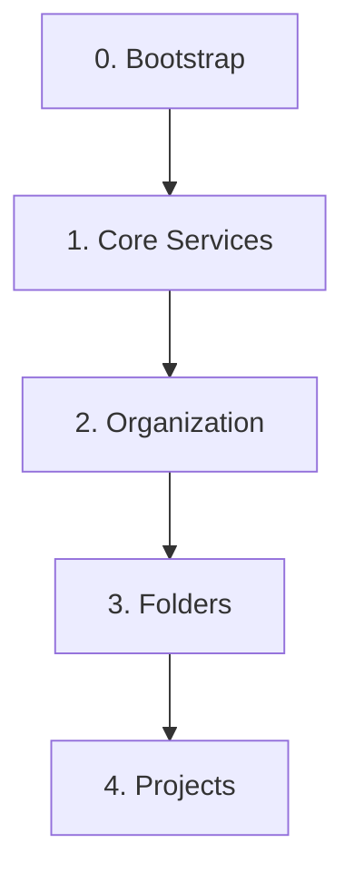

# GCP Foundations (Terraform IaC)

このリポジトリは、Terraformを使用してGoogle Cloud Platform (GCP) 環境を体系的に構築・管理するための Infrastructure as Code (IaC) 基盤です。ガバナンスを確保しつつ、セキュアで再利用可能なGCP環境を効率的に展開することを目的とします。初心者でも迷わず、再現性高くセキュアなGCP環境を展開できるように設計されています。

## 🚀 5分でわかるクイックスタート

まずはローカル環境で自動生成と品質チェックを試してみましょう。

```bash
# 1. リポジトリのクローン
git clone https://github.com/ea-Mitsuoka/gcp-foundations.git
cd gcp-foundations

# 2. テンプレートExcelの生成 (uvがインストールされている前提)
make generate

# 3. 生成されたコードの品質チェック (Linterの実行)
make lint
```
※ 実際のデプロイにはGCP権限と初期セットアップが必要です。詳細は [セットアップガイド](docs/setup/initial_setup.md) を参照してください。

## 📚 ドキュメントインデックス (ここから読み始めてください)

本リポジトリの設計や運用に関するあらゆる情報は、以下のドキュメントに集約されています。目的別にカテゴリ分けされています。

### 📌 初期構築・セットアップ (Setup)

一番最初に実行する環境構築手順や、開発者としての参加手順です。

1. **[環境構築の全体手順 (新規顧客向け)](docs/setup/initial_setup.md)**: 基盤のゼロからの構築・デプロイ手順
1. **[複数環境の管理と方針](docs/setup/setup_environment.md)**: Workspaceを利用しないSSOTベースの管理思想
1. **[ローカル開発環境セットアップガイド](docs/development/local_development.md)**: 開発者向けの必須ツールのインストールと設定

### ⚙️ 日常運用手順 (Operations)

日々のリソース作成や更新、引き渡しを行う際のマニュアルです。

1. **[プロジェクトのライフサイクル管理](docs/operations/project_lifecycle.md)**: スプレッドシート（SSOT）に基づく作成・運用・管理
1. **[フォルダの作成手順](docs/operations/folder_creation.md)**: Terraformによるフォルダ階層の管理
1. **[共通モジュールのメンテナンス](docs/operations/module_maintenance.md)**: モジュール改修時のデプロイ戦略
1. **[顧客引き渡し手順](docs/operations/handover_procedure.md)**: 納品時に実行するGit履歴のクリアと権限移譲の手順

### 📖 リファレンス・設計資料 (Reference & Architecture)

本基盤の設計思想や、詳細な仕様です。

1. **[アーキテクチャ設計書](docs/design/architecture.md)**: 全体俯瞰図とSSOT・レイヤー構造の解説
1. **[ベストプラクティス集](docs/reference/best_practices.md)**: インフラ運用とIAM・権限管理の方針
1. **[スプレッドシートの仕様書](docs/reference/spreadsheet_format.md)**: `gcp_foundations.xlsx` (SSOT) のカラム定義
1. **[データディクショナリ](docs/design/data-dictionary.md)**: Terraform変数の定義や命名規則
1. **[非アクティブアカウント監視方針](docs/reference/inactive_account_monitoring.md)**: 90日間の未ログイン検知の仕組み

### 🛠️ 便利な Makefile コマンド

日々の運用や開発において、パスや長大なコマンドを覚える必要はありません。リポジトリルートで `make` を使用してください。

```bash
make help       # 利用可能な全コマンドの表示
make generate   # Excel(SSOT)からTerraform変数や構成を自動生成
make lint       # Terraform, ShellscriptのLint・フォーマット実行
make opa        # Regoポリシーの構文チェック
make test       # モジュールの単体テスト実行
make deploy     # 基盤全体の一括デプロイ実行
```

## 📖 設計思想

この基盤は、責務の分離と段階的なインフラ構築を重視した**レイヤー構造**を採用しています。各レイヤーは独立したTerraformのルートモジュールとして管理され、下位のレイヤーに依存します。



- **Layer 0: Bootstrap**
  - Terraformの実行基盤自体を構築します。
  - 責務: `tfstate`を管理するGCSバケットの作成。
- **Layer 1: Core Services**
  - 組織全体で共有される中核サービス（ログ集約、モニタリングなど）を構築します。このレイヤーは、**`base`** と **`services`** という2つのサブディレクトリに分かれており、責務が明確に分離されているのが特徴です。
    - `1_core/base/`: 共有プロジェクトという「器」そのものを作成する責務を担います。（例: `logsink`プロジェクト）
    - `1_core/services/`: `base`で作成した「器」の中に、API有効化やログシンク設定といった具体的な「中身（サービス）」を実装する責務を担います。
  - この「器」と「中身」を分離する設計により、インフラの構成がシンプルで見通しが良くなり、将来的な機能追加も容易になっています。
  - 責務: 共有プロジェクトの作成と、そのプロジェクト内へのサービス実装。
- **Layer 2: Organization**
  - 組織全体に適用されるポリシーやIAM設定を管理します。
  - 責務: 組織ポリシー、組織レベルでのIAM設定。
- **Layer 3: Folders**
  - `production`, `staging`, `development` といった、リソースを階層的に管理するためのフォルダ構造を定義します。
  - 責務: 基本となるフォルダの作成とIAM設定。
- **Layer 4: Projects**
  - "Project Factory" パターンに基づき、各アプリケーションやチームのためのGCPプロジェクトを作成します。
  - 責務: アプリケーションごとのプロジェクトの作成、API有効化、サービスアカウント設定など。

## 🚀 ワンストップ・デプロイ

すべてのリソースのデプロイは、以下のスクリプトを1回叩くだけで完了します。

```bash
make deploy
```

※ 事前に `gcp_foundations.xlsx` と `domain.env` を更新し、Single Source of Truth (SSOT) を最新化してください。

______________________________________________________________________

## 🚀 新規顧客向け 環境構築手順

このリポジトリをテンプレートとして使い、新しい顧客のGCP組織にインフラ基盤を払い出すためのセットアップは、自動化スクリプトを実行するだけで簡単に行えます。

### 前提条件

- `gcloud` CLI, `terraform` CLI, `git`, `openssl`, `uv` がローカル環境にインストールされていること。

- **Google Groups の事前作成 (必須):**
  Google Workspace (または Cloud Identity) 上で、後述の組織IAMに必要な以下のグループ（メーリングリスト）を事前に作成しておいてください。

  - `gcp-organization-admins@<顧客ドメイン>`
  - `gcp-billing-admins@<顧客ドメイン>`
  - `gcp-vpc-network-admins@<顧客ドメイン>`
  - `gcp-hybrid-connectivity-admins@<顧客ドメイン>`
  - `gcp-logging-monitoring-admins@<顧客ドメイン>`
  - `gcp-logging-monitoring-viewers@<顧客ドメイン>`
  - `gcp-security-admins@<顧客ドメイン>`
  - `gcp-devops@<顧客ドメイン>`

- 顧客のGCP組織に対する**組織管理者**などの強い権限を持つアカウントで、`gcloud`にログイン済みであること。

  ```bash
  gcloud auth login
  gcloud auth application-default login
  ```

### 手順

1. **リポジトリをクローンします。**

   ```bash
   git clone https://github.com/ea-Mitsuoka/gcp-foundations.git
   cd gcp-foundations
   ```

1. **便利なエイリアスとパスを設定（推奨）**

   以下のコマンドを実行して、エイリアスとパスを設定します。

   ```bash
   # エイリアスの設定
   alias git-root='echo "$(git rev-parse --show-toplevel)"'

   # スクリプトへのパスを通す
   export PATH="$(git rev-parse --show-toplevel)/terraform/scripts:$PATH"
   ```

   この設定はターミナルセッションを閉じるとリセットされるため、.bashrcや.zshrcに追記することを推奨します。

1. **自動化スクリプトを実行します。(要動作確認)**
   `setup_new_client.sh` スクリプトが、対話形式で必要な情報を質問し、tfstate管理基盤の構築を自動で行います。

   ```bash
   chmod +x terraform/scripts/setup_new_client.sh
   ./terraform/scripts/setup_new_client.sh
   ```

1. **手動で課金アカウントをリンクします。**
   スクリプトの最後に表示される`gcloud billing projects link ...`コマンドを実行し、管理用プロジェクトに課金アカウントを手動で紐付けます。これは、権限の都合上、手動での実行が必須となっています。

1. **`0_bootstrap` を適用します。**
   スクリプトの案内に従い、`0_bootstrap`ディレクトリで`terraform init`と`terraform apply`を実行し、Terraformの管理をGCSバックエンドで開始します。

これ以降の`1_core`からの各レイヤーの適用については、`docs/setup/initial_setup.md`の詳細な手順を参照してください。

## 🤝 コントリビューションとセキュリティ

本プロジェクトへの貢献方法やバグ報告のルールについては、以下のドキュメントを必ずご確認ください。

- **[貢献ガイドライン (CONTRIBUTING.md)](CONTRIBUTING.md)**: PRの作成手順やコーディング規約、行動規範について。
- **[セキュリティポリシー (SECURITY.md)](SECURITY.md)**: 脆弱性の報告方法やシークレット管理の原則について。

## CI/CDによる自動化

このリポジトリでは、GitHub Actionsを用いたCI/CDパイプラインが `.github/workflows/` に定義されています。

______________________________________________________________________

## 📂 リポジトリ構成

```plaintext
gcp-foundations/
├── .github/
│   └── workflows/          # CI/CDワークフロー (PR時の自動チェック等)
├── docs/                   # マニュアル・設計資料 (ここを読めばすべてわかる)
├── policies/               # セキュリティ統制ルール (Rego/OPA)
├── scripts/                # 運用補助スクリプト
└── terraform/              # インフラ定義の本体
    ├── 0_bootstrap/        # L0: 基盤の「鍵」となるtfstate管理用の器
    ├── 1_core/             # L1: ログ集約・監視・共通NWなどの「心臓部」
    ├── 2_organization/     # L2: 組織全体に強制するセキュリティポリシー
    ├── 3_folders/          # L3: 組織図を反映するフォルダ階層 (自動生成)
    ├── 4_projects/         # L4: 各アプリが動くプロジェクト (自動生成)
    ├── modules/            # 再利用可能な部品 (プロジェクト、API有効化等)
    └── configs/            # グローバルな共通変数
```
