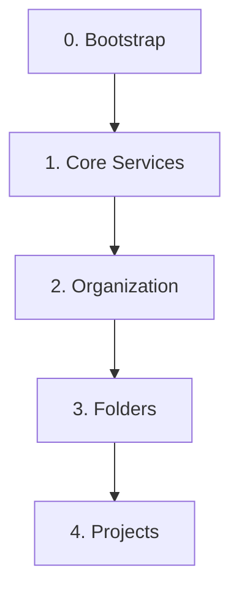

# GCP Foundations (Terraform IaC)

このリポジトリは、Terraform を使用して Google Cloud Platform (GCP) 環境を体系的に構築・管理するための Infrastructure as Code (IaC) 基盤です。ガバナンスを確保しつつ、セキュアで再利用可能な GCP 環境を効率的に展開することを目的とし、初心者でも迷わず・再現性高く構築できるよう設計されています。

## 🌟 主な特長

- **階層構造の自動生成**: Excel (SSoT) に定義するだけで、GCP 組織直下のフォルダ構造やプロジェクトを自動作成。
- **ネットワークとセキュリティの統合管理**: Shared VPC のサブネット、VPC Service Controls (VPC-SC) の境界・アクセスレベルを Excel 上で一元管理。
- **段階的な組織ポリシーの適用**: 移行プロジェクトに配慮し、初期は組織ポリシーを無効化した状態で作成可能。準備が整い次第、Excel の定義に基づき段階的にガードレールを適用。
- **責務の分離による迅速な払い出し**: アプリ用プロジェクトの API 有効化を現場に委譲し、基盤チームはネットワークやセキュリティ境界という「セキュアな箱」の提供に集中。
- **Terraform による透過的な管理**: 全ての設定は Terraform コードへ変換・ステート管理され、IaC としての整合性を維持。

## 🚀 クイックスタート（ローカルでお試し）

まずはローカルで、自動生成と品質チェックの流れを体験できます（GCP への接続は不要）。

```bash
git clone https://github.com/ea-Mitsuoka/gcp-foundations.git
cd gcp-foundations

make install    # 必要ツールの同期 (uv)
make generate   # Excel(SSoT) から Terraform 構成を生成（初回はテンプレート作成）
make lint       # 生成コードの品質チェック
```

> 実際に GCP 環境へ構築・デプロイする場合は、下の **[環境構築手順（新規顧客向け）](#-環境構築手順新規顧客向け)** へ進んでください。

## 📚 ドキュメントインデックス

目的別に整理しています。まずはここから読み始めてください。

### 📌 セットアップ

- **[環境構築の全体手順 (セッション用)](docs/setup/initial_setup.md)**: 基盤のゼロからの構築・デプロイ手順
- **[Google グループ作成ガイド](docs/setup/google_groups_creation.md)**: Cloud セットアップを活用した効率的なグループ作成
- **[スプレッドシート・ワークショップ・ガイド](docs/operations/spreadsheet_session_guide.md)**: 顧客と一緒に設計図を完成させるためのガイド
- **[複数環境の管理と方針](docs/setup/setup_environment.md)**: Workspace を使わない SSoT ベースの管理思想
- **[ローカル開発環境セットアップガイド](docs/development/local_development.md)**: 開発者向けの必須ツールのインストールと設定

### ⚙️ 運用

- **[プロジェクトのライフサイクル管理](docs/operations/project_lifecycle.md)**: SSoT に基づく作成・運用・管理
- **[組織なしプロジェクトの組織移管 リスク確認 & Terraform 取り込み](docs/migration/project_migration_risk_check.md)**: 既存スタンドアロンプロジェクトを組織配下へ移管する際のリスク分析と import 手順
- **[トラブルシューティング・ガイド](docs/operations/troubleshooting.md)**: 構築・運用中によくある問題と解決策
- **[環境の一括解体・クリーンアップガイド](docs/operations/environment_destruction.md)**: make destroy の仕様とオプション解説
- **[フォルダの作成手順](docs/operations/folder_creation.md)**: Terraform によるフォルダ階層の管理
- **[共通モジュールのメンテナンス](docs/operations/module_maintenance.md)**: モジュール改修時のデプロイ戦略
- **[後任者・リカバリガイド](docs/operations/recovery_and_succession.md)**: 設定ファイルの復元と安全な引き継ぎ
- **[運用引き継ぎ・セットアップ手順](docs/operations/operational_takeover.md)**: 認証・権限取得、CI/CD 有効化、差分確認（make generate / plan）による運用開始手順
- **[顧客引き渡し手順](docs/operations/handover_procedure.md)**: （構築ベンダー向け）make delivery による納品成果物の作成と権限移譲の手順
- **[納品物（構築設定明細書）自動生成 機能説明](docs/operations/delivery_document_generation.md)**: `make delivery` が SSoT から日本のベンダー様式の設定明細書 Excel を自動生成する仕組み

### 📖 リファレンス・設計

- **[アーキテクチャ設計書](docs/design/architecture.md)**: 全体俯瞰図と SSoT・レイヤー構造の解説
- **[ベストプラクティス集](docs/reference/best_practices.md)**: インフラ運用と IAM・権限管理の方針
- **[スプレッドシートの仕様書](docs/setup/spreadsheet_format.md)**: `gcp-foundations.xlsx` (SSoT) のカラム定義（Shared VPC, VPC-SC, 組織ポリシーを含む）
- **[データディクショナリ](docs/design/data-dictionary.md)**: Terraform 変数の定義や命名規則
- **[ガバナンス・エボリューション・ガイド](docs/reference/governance_guideline.md)**: 運用継続のポイントと責務の境界線についての指針
- **[自動生成エンジンの設計思想](docs/design/generator_philosophy.md)**: `make generate` の内部設計・拡張方針
- **[IAM 管理スコープと運用境界](docs/design/iam_management_scope.md)**: Terraform が管理する IAM の境界、非権威的(`_iam_member`)運用の不変条件、小規模・グループ非採用パターンと補償統制
- **[監査基盤 BigQuery 活用ガイド](docs/reference/cloud_asset_inventory_export.md)**: `asset_inventory`（IAM 台帳）と `audit_logs`（監査ログ）の仕様と実践 SQL クエリ集
- **[AI向けリポジトリ理解ガイド](docs/development/ai_handoff.md)**: AI がこのリポジトリを最短で正確に理解するためのマスタープロンプト

## 🛠️ Makefile コマンド

リポジトリルートで `make <command>` を実行します（長いコマンドを覚える必要はありません）。

```bash
make help       # 利用可能な全コマンドの表示
make setup      # 初期構築（管理用プロジェクト・tfstateバケットの作成・Layer 0 適用）
make check      # GCP権限・課金・API有効化のプリフライト確認
make generate   # Excel(SSoT)からTerraform変数や構成を自動生成
make lint       # Terraform, ShellscriptのLint・フォーマット実行
make opa        # Regoポリシーの構文チェック
make test       # モジュールの単体テスト実行
make plan       # 基盤全体の変更差分を確認（applyせずにplanのみ実行）
make deploy     # 基盤全体の一括デプロイ実行
make prune      # SSoTから削除されたプロジェクトの残骸ディレクトリを対話形式で削除
make delivery   # 納品物(構築設定明細書)生成 → 納品用リポジトリの作成
make delivery-doc # 納品物(構築設定明細書)のみを delivery/ に生成
```

## 🏗️ アーキテクチャ

責務の分離と段階的なインフラ構築を重視した**レイヤー構造**を採用しています。各レイヤーは独立した Terraform のルートモジュールとして管理され、下位のレイヤーに依存します。



| レイヤー | 役割 | 主な責務 |
| :--- | :--- | :--- |
| **L0: Bootstrap** | Terraform 実行基盤の構築 | `tfstate` を管理する GCS バケットの作成 |
| **L1: Core Services** | 組織共通の中核サービス | `base`＝共有プロジェクトの「器」（例: logsink）／ `services`＝その器の中身（API 有効化・ログシンク設定等） |
| **L2: Organization** | 組織全体の統制 | 組織ポリシー、組織レベルの IAM 設定 |
| **L3: Folders** | フォルダ階層 | production / staging / development 等のフォルダ作成と IAM（自動生成） |
| **L4: Projects** | アプリ用プロジェクト | "Project Factory" による作成・API 有効化・サービスアカウント設定（自動生成） |

ディレクトリ構成：

```plaintext
gcp-foundations/
├── .github/workflows/      # CI/CD ワークフロー (PR時の自動チェック、Drift検知等)
├── docs/                   # マニュアル・設計資料
├── policies/               # セキュリティ統制ルール (Rego/OPA)
└── terraform/              # インフラ定義の本体
    ├── 0_bootstrap/        # L0: tfstate 管理用の器
    ├── 1_core/             # L1: ログ集約・監視・共通NWなどの心臓部
    ├── 2_organization/     # L2: 組織全体に強制するセキュリティポリシー
    ├── 3_folders/          # L3: 組織図を反映するフォルダ階層 (自動生成)
    ├── 4_projects/         # L4: 各アプリが動くプロジェクト (自動生成)
    ├── modules/            # 再利用可能な部品 (プロジェクト、API有効化等)
    └── scripts/            # 運用補助スクリプト
```

## 🚀 環境構築手順（新規顧客向け）

このリポジトリをテンプレートとして、新しい顧客の GCP 組織に基盤を払い出す手順です。自動化スクリプトの実行が中心です。

### 前提条件

- `gcloud` CLI / `terraform` CLI / `git` / `openssl` / `uv` がローカルにインストール済み。
- **Google グループの事前作成（必須）**: 組織 IAM 用に以下のグループ（メーリングリスト）を Cloud Identity / Workspace で作成しておくこと（[Google グループ作成ガイド](docs/setup/google_groups_creation.md)）。

  ```text
  gcp-organization-admins@<顧客ドメイン>     gcp-logging-monitoring-admins@<顧客ドメイン>
  gcp-billing-admins@<顧客ドメイン>          gcp-logging-monitoring-viewers@<顧客ドメイン>
  gcp-vpc-network-admins@<顧客ドメイン>      gcp-security-admins@<顧客ドメイン>
  gcp-hybrid-connectivity-admins@<顧客ドメイン>  gcp-developers@<顧客ドメイン>
  gcp-devops@<顧客ドメイン>
  ```

- **`make setup` 実行アカウントの組織レベル権限**（以下 4 ロール）と、そのアカウントでの `gcloud` ログイン。

  | 表示名 | ロール ID |
  | :--- | :--- |
  | 組織管理者 | `roles/resourcemanager.organizationAdmin` |
  | フォルダ管理者 | `roles/resourcemanager.folderAdmin` |
  | プロジェクト作成者 | `roles/resourcemanager.projectCreator` |
  | 請求先アカウント管理者 | `roles/billing.admin` |

  ```bash
  gcloud auth login
  gcloud auth application-default login
  ```

### 手順

```bash
# 1. クローン
git clone https://github.com/ea-Mitsuoka/gcp-foundations.git
cd gcp-foundations

# 2. 初期構築（依存関係 → シードリソース）
make install
make setup        # 管理プロジェクト・tfstateバケット・SA・IAM の構築 + Layer 0 の apply まで自動

# 3. SSoT を最新化してデプロイ
#    gcp-foundations.xlsx と domain.env を編集（フォルダ/プロジェクト等を定義）
make generate     # SSoT から Terraform 構成を生成
make deploy       # 依存関係を考慮して全レイヤー(L1〜L4)を一括デプロイ
```

> `make setup` は対話形式で必要情報を質問し、**Layer 0 (`0_bootstrap`) の `terraform apply` までを自動実行**します（手動の 0_bootstrap 適用は不要）。L1〜L4 の詳細な展開手順は **[環境構築の全体手順 (セッション用)](docs/setup/initial_setup.md)** を参照してください。

## 🔄 CI/CD による自動化

`.github/workflows/` に GitHub Actions の CI/CD を定義しています。

- **PR 時の自動チェック**: プルリクエスト作成時に `terraform plan` と OPA(Rego) によるセキュリティ/構成チェックを自動実行。
- **Drift 検知**: 毎週日曜に全環境の `terraform plan` を実行し、コードと実環境の乖離（ドリフト）を検知・通知。

> **【重要】** CI を動作させるには、GitHub Secrets に `BILLING_ACCOUNT_ID`（本物の請求先アカウント ID）等の設定が必要です。WIF の構築を含む有効化手順は **[運用引き継ぎ・セットアップ手順](docs/operations/operational_takeover.md)** を参照してください。
