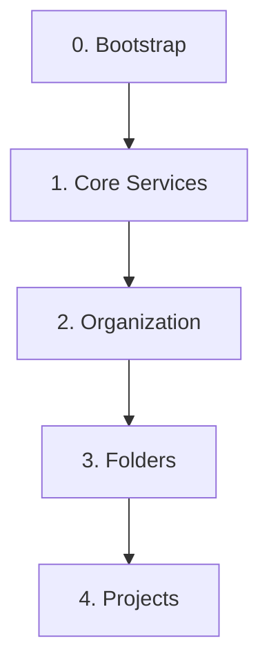

# GCP Foundations (Terraform IaC)

このリポジトリは、Terraformを使用してGoogle Cloud Platform (GCP) 環境を体系的に構築・管理するための Infrastructure as Code (IaC) 基盤です。ガバナンスを確保しつつ、セキュアで再利用可能なGCP環境を効率的に展開することを目的とします。

## 📖 設計思想

この基盤は、責務の分離と段階的なインフラ構築を重視した**レイヤー構造**を採用しています。各レイヤーは独立したTerraformのルートモジュールとして管理され、下位のレイヤーに依存します。



- **Layer 0: Bootstrap**
  - Terraformの実行基盤自体を構築します。
  - 責務: `tfstate`を管理するGCSバケットの作成。
- **Layer 1: Core Services**
  - 組織全体で共有される中核サービス（ログ集約、モニタリングなど）を構築します。このレイヤーは、**`base`** と **`services`** という2つのサブディレクトリに分かれており、責務が明確に分離されているのが特徴です。
    - `1_core/base/`: 共有プロジェクトという「器」そのものを作成する責務を担います。（例: `logsink`プロジェクト）
    - `1_core/services/`: `base`で作成した「器」の中に、API有効化やログシンク設定といった具体的な「中身（サービス）」を実装する責務を担います。
  - この「器」と「中身」を分離する設計により、インフラの構成がシンプルで見通しが良くなり、将来的な機能追加も容易になっています。
  - 責務: 共有プロジェクトの作成と、そのプロジェクト内へのサービス実装。
- **Layer 2: Organization**
  - 組織全体に適用されるポリシーやIAM設定を管理します。
  - 責務: 組織ポリシー、組織レベルでのIAM設定。
- **Layer 3: Folders**
  - `production`, `staging`, `development` といった、リソースを階層的に管理するためのフォルダ構造を定義します。
  - 責務: 基本となるフォルダの作成とIAM設定。
- **Layer 4: Projects**
  - "Project Factory" パターンに基づき、各アプリケーションやチームのためのGCPプロジェクトを作成します。
  - 責務: アプリケーションごとのプロジェクトの作成、API有効化、サービスアカウント設定など。

______________________________________________________________________

## 🚀 新規顧客向け 環境構築手順

このリポジトリをテンプレートとして使い、新しい顧客のGCP組織にインフラ基盤を払い出すためのセットアップは、自動化スクリプトを実行するだけで簡単に行えます。

### 前提条件

- `gcloud` CLI, `terraform` CLI, `git`, `openssl` がローカル環境にインストールされていること。
- 顧客のGCP組織に対する**組織管理者**などの強い権限を持つアカウントで、`gcloud`にログイン済みであること。
  ```bash
  gcloud auth login
  gcloud auth application-default login
  ```

### 手順

1. **リポジトリをクローンします。**

   ```bash
   git clone https://github.com/ea-Mitsuoka/gcp-foundations.git
   cd gcp-foundations
   ```

1. **便利なエイリアスとパスを設定（推奨）**

    以下のコマンドを実行して、エイリアスとパスを設定します。

    ```bash
    # エイリアスの設定
    alias git-root='echo "$(git rev-parse --show-toplevel)"'

    # スクリプトへのパスを通す
    export PATH="$(git rev-parse --show-toplevel)/terraform/scripts:$PATH"
    ```

    この設定はターミナルセッションを閉じるとリセットされるため、.bashrcや.zshrcに追記することを推奨します。

1. **自動化スクリプトを実行します。(要動作確認)**
   `setup_new_client.sh` スクリプトが、対話形式で必要な情報を質問し、tfstate管理基盤の構築を自動で行います。

   ```bash
   chmod +x terraform/scripts/setup_new_client.sh
   ./terraform/scripts/setup_new_client.sh
   ```

1. **手動で課金アカウントをリンクします。**
   スクリプトの最後に表示される`gcloud billing projects link ...`コマンドを実行し、管理用プロジェクトに課金アカウントを手動で紐付けます。これは、権限の都合上、手動での実行が必須となっています。

1. **`0_bootstrap` を適用します。**
   スクリプトの案内に従い、`0_bootstrap`ディレクトリで`terraform init`と`terraform apply`を実行し、Terraformの管理をGCSバックエンドで開始します。

これ以降の`1_core`からの各レイヤーの適用については、`docs/procedures/first_env_setup.md`の詳細な手順を参照してください。

## CI/CDによる自動化

このリポジトリでは、GitHub Actionsを用いたCI/CDパイプラインが `.github/workflows/` に定義されています。

### 削除予定の記述

下記ファイル群は構想段階で未作成

- `org-apply.yml`: 組織レイヤー (`2_organization`) への変更を自動適用します。
- `folders-apply.yml`: フォルダレイヤー (`3_folders`) への変更を自動適用します。
- `projects-apply.yml`: プロジェクトレイヤー (`4_projects`) への変更を自動適用します。

______________________________________________________________________

## 📂 リポジトリ構成

```plaintext
gcp-foundations/
├── .github/
│   └── workflows/          # CI/CDワークフロー (GitHub Actions)
├── docs/                   # 設計資料、手順書などのドキュメント
├── policies/               # ポリシー・アズ・コード (Open Policy Agent)
├── scripts/                # 各種ヘルパースクリプト
└── terraform/              # Terraformコードのルート
    ├── 0_bootstrap/        # レイヤー0: Terraform実行基盤
    ├── 1_core/             # レイヤー1: コアサービス (ログ、監視)
    ├── 2_organization/     # レイヤー2: 組織全体の設定
    ├── 3_folders/          # レイヤー3: フォルダ構造
    ├── 4_projects/         # レイヤー4: プロジェクトファクトリー
    ├── modules/            # 共通Terraformモジュール
    └── configs/            # 環境ごとの設定ファイル
```
