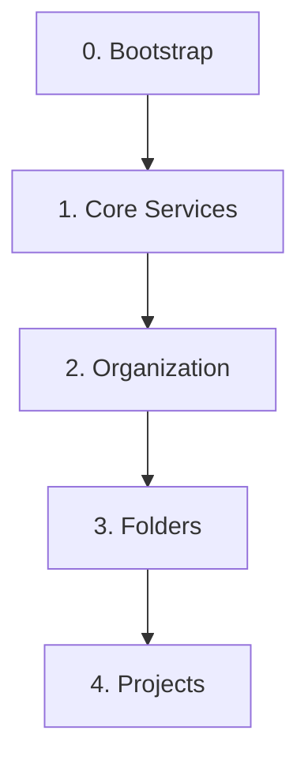

# GCP Foundations (Terraform IaC)

このリポジトリは、Terraformを使用してGoogle Cloud Platform (GCP) 環境を体系的に構築・管理するための Infrastructure as Code (IaC) 基盤です。ガバナンスを確保しつつ、セキュアで再利用可能なGCP環境を効率的に展開することを目的とします。

## 📖 設計思想

この基盤は、責務の分離と段階的なインフラ構築を重視した**レイヤー構造**を採用しています。各レイヤーは独立したTerraformのルートモジュールとして管理され、下位のレイヤーに依存します。



- **Layer 0: Bootstrap**
  - Terraformの実行基盤自体を構築します。
  - 責務: `tfstate`を管理するGCSバケットの作成。
- **Layer 1: Core Services**
  - 組織全体で共有されるログ集約やモニタリングなどの中核サービスを構築します。
  - 責務: ログ集約プロジェクト、モニタリングプロジェクトの作成と設定。
- **Layer 2: Organization**
  - 組織全体に適用されるポリシーやIAM設定を管理します。
  - 責務: 組織ポリシー、組織レベルでのIAM設定。
- **Layer 3: Folders**
  - `production`, `staging`, `development` といった、リソースを階層的に管理するためのフォルダ構造を定義します。
  - 責務: 基本となるフォルダの作成とIAM設定。
- **Layer 4: Projects**
  - "Project Factory" パターンに基づき、各アプリケーションやチームのためのGCPプロジェクトを作成します。
  - 責務: アプリケーションごとのプロジェクトの作成、API有効化、サービスアカウント設定など。

---

## 🚀 環境構築手順

### 前提条件

- `gcloud` CLIがインストールされ、認証済みであること。
- `terraform` CLIがインストールされていること。
- GCPの組織 (Organization) が存在し、自身のユーザーにそれを管理する権限があること。

### 1. リポジトリのクローンと初期設定

1. **リポジトリをクローンします。**

    ```bash
    git clone https://github.com/ea-Mitsuoka/gcp-foundations.git
    cd gcp-foundations
    ```

2. **ドメインを設定します。**
    リポジトリのルートに `domain.env` ファイルを作成し、GCPの組織に紐づくドメインを記述します。（例: `example.com`）

    ```bash
    echo "your-domain.com" > domain.env
    ```

3. **便利なエイリアスとパスを設定します。（推奨）**
    スクリプトを簡単に実行するために、エイリアスとパスを設定します。

    ```bash
    # エイリアスの設定
    alias git-root='echo "$(git rev-parse --show-toplevel)"'

    # スクリプトへのパスを通す
    export PATH="$(git rev-parse --show-toplevel)/terraform/scripts:$PATH"
    ```

    *この設定はターミナルセッションを閉じるとリセットされるため、`.bashrc`や`.zshrc`に追記することを推奨します。*

4. **スクリプトに実行権限を付与します。**

    ```bash
    chmod +x terraform/scripts/*.sh
    ```

### 2. Terraformバックエンドの設定

1. **設定スクリプトを実行します。**
    以下のスクリプトが `terraform/` 配下の各ディレクトリに `backend.tf` を自動生成し、必要な変数を設定します。

    ```bash
    generate-backend-config.sh
    sync-domain-to-tfvars.sh
    setup-project-context.sh
    ```

### 3. Terraformの段階的な適用

`docs/first_env_setup.md` の詳細な手順に従い、以下の順序で各レイヤーのTerraformコードを適用していきます。

1. **`terraform/0_bootstrap`**
    - `tfstate`管理用のGCSバケットを作成します。これは手動での適用が必要です。

2. **`terraform/1_core/base/logsink`**
    - ログ集約用のプロジェクトを作成します。

3. **`terraform/1_core/base/monitoring`**
    - モニタリング用のプロジェクトを作成します。

4. 以降、`2_organization`, `3_folders`, `4_projects` の順に必要に応じて適用します。

---

## CI/CDによる自動化

このリポジトリでは、GitHub Actionsを用いたCI/CDパイプラインが `.github/workflows/` に定義されています。

- `org-apply.yml`: 組織レイヤー (`2_organization`) への変更を自動適用します。
- `folders-apply.yml`: フォルダレイヤー (`3_folders`) への変更を自動適用します。
- `projects-apply.yml`: プロジェクトレイヤー (`4_projects`) への変更を自動適用します。

`main`ブランチにマージされると、これらのワークフローがトリガーされ、`terraform apply`が自動的に実行されます。

---

## 📂 リポジトリ構成

```plaintext
gcp-foundations/
├── .github/
│   └── workflows/          # CI/CDワークフロー (GitHub Actions)
├── docs/                   # 設計資料、手順書などのドキュメント
├── policies/               # ポリシー・アズ・コード (Open Policy Agent)
├── scripts/                # 各種ヘルパースクリプト
└── terraform/              # Terraformコードのルート
    ├── 0_bootstrap/        # レイヤー0: Terraform実行基盤
    ├── 1_core/             # レイヤー1: コアサービス (ログ、監視)
    ├── 2_organization/     # レイヤー2: 組織全体の設定
    ├── 3_folders/          # レイヤー3: フォルダ構造
    ├── 4_projects/         # レイヤー4: プロジェクトファクトリー
    ├── modules/            # 共通Terraformモジュール
    └── configs/            # 環境ごとの設定ファイル
```
