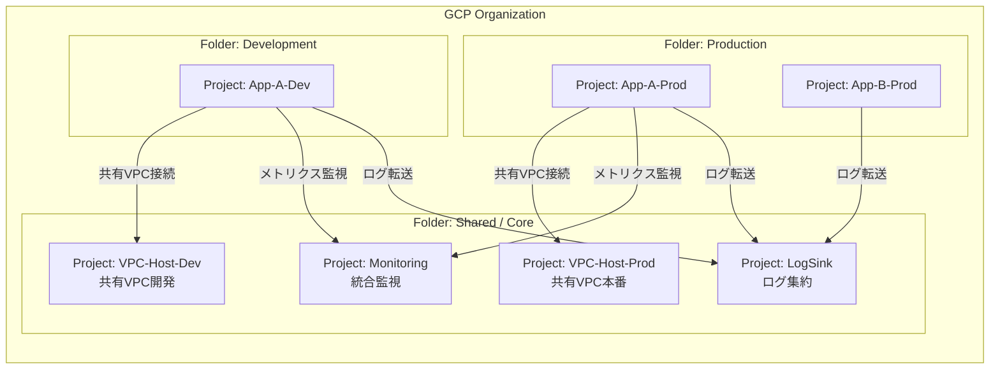

# アーキテクチャ設計書 (GCP Foundations)

本ドキュメントでは、本リポジトリで構築されるGCP環境の全体像、リソース階層、セキュリティ、および運用設計について解説します。

---

## 1. 全体俯瞰図 (High-Level Architecture)

本基盤は、組織全体をカバーする「コアサービス」と、各アプリケーションが動く「ワークロード領域」を明確に分離した設計になっています。

---

## 2. リソース階層構造 (Resource Hierarchy)

Google Cloud のベストプラクティスに従い、フォルダによる環境分離と、中央集約的な管理プロジェクトを配置しています。

- **Organization**: 基盤のルート。組織ポリシーとIAMによる統制を適用。
  - **Shared フォルダ**: 組織全体で共有するインフラ。
    - **Bootstrap プロジェクト**: Terraform の `tfstate` 管理専用。
    - **LogSink プロジェクト**: 全プロジェクトの監査ログ・課金ログを BigQuery/GCS に集約。
    - **Monitoring プロジェクト**: 組織全体の監視ダッシュボード、アラート通知。
  - **Production フォルダ**: 本番環境のアプリケーションプロジェクト群。
    - **VPC-Host-Prod**: 本番用 Shared VPC ネットワークの管理。
  - **Development フォルダ**: 開発・検証環境のプロジェクト群。
    - **VPC-Host-Dev**: 開発用 Shared VPC ネットワークの管理。

---

## 3. セキュリティ設計

### 3.1. ポリシー・アズ・コード (Policy as Code)
- **Organization Policies**: `Layer 2: Organization` にて、外部IPの制限、デフォルトネットワークの作成禁止、信頼できるイメージの使用などの制約を組織レベルで強制します。
- **OPA (Open Policy Agent)**: `policies/` ディレクトリに Rego 言語で独自のガバナンスルール（例：必須ラベルのチェック）を定義し、CI/CD パイプラインでデプロイ前に検証します。

### 3.2. VPC Service Controls (VPC-SC)
機密データの流出を防ぐため、サービス境界（Perimeter）を構築可能です。
- `Layer 2` で境界の枠組み（Policy/Perimeter）を作成。
- `Layer 4` で各プロジェクトを自動的に境界内に取り込みます。
- **保護対象サービス**: Cloud Storage, BigQuery, Compute Engine など。

### 3.3. IAM (最小権限の原則)
- 作業者は直接 `Owner` 権限を持つのではなく、Terraform 専用サービスアカウントを**借用 (Impersonate)** して作業します。
- これにより、個人の認証情報をコードに持たせることなく、セキュアな権限管理を実現します。

---

## 4. ログ・監視設計 (Observability)

### 4.1. ログ集約 (Log Aggregation)
組織全体のログを一箇所に集めることで、監査対応や全社的な分析を容易にします。
- **収集対象**: 管理アクティビティログ、データアクセスログ、システムのイベントログ、課金ログ。
- **保存先**: 
  - **BigQuery**: 長期分析用（SQLによる検索）。
  - **Cloud Storage**: アーカイブ・法規制対応用（低コスト保存）。

### 4.2. 統合監視 (Centralized Monitoring)
監視用プロジェクトに各プロジェクトのモニタリングスコープ（Scoping）を紐付け、単一のダッシュボードでシステム全体の死活監視やパフォーマンス監視を行います。

---

## 5. デプロイメント・レイヤー (Layered Deployment)

依存関係を最小限に抑え、変更の影響を局所化するために5つのレイヤーに分けてデプロイします。

| Layer | 名称 | 役割 | 依存先 |
| :--- | :--- | :--- | :--- |
| **0** | **Bootstrap** | Terraformの土台 (GCS Bucket) の作成 | なし |
| **1** | **Core Services** | ログ集約・監視・VPCホストプロジェクトの作成 | 0 |
| **2** | **Organization** | 組織ポリシー、組織IAM、VPC-SC境界の定義 | 1 |
| **3** | **Folders** | Prod/Dev/Shared フォルダ構造の構築 | 2 |
| **4** | **Projects** | アプリ用プロジェクトの作成と各種サービス有効化 | 3 |

---

## 6. Single Source of Truth (SSOT)

本基盤の構成は、すべて `gcp_foundations.xlsx` (Excel) によって定義されます。
このファイルを書き換えて `make generate` を実行することで、複雑なディレクトリ構造や `tfvars` が自動生成され、人為的な設定ミスを排除します。
