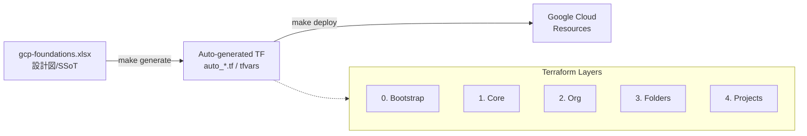
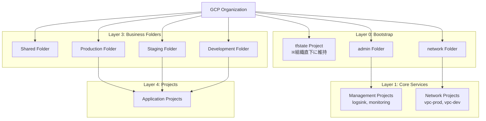

# アーキテクチャ設計書 (GCP Foundations)

本ドキュメントでは、本リポジトリで構築されるGCP環境の全体像、設計思想、および運用設計について解説します。

______________________________________________________________________

## 1. 設計思想 (Core Philosophy)

本基盤は、大規模な組織運用に耐えうる「堅牢性」と、誰が実行しても同じ結果が得られる「再現性」を重視して設計されています。

- **Single Source of Truth (SSoT)**: すべての構成（プロジェクト名、API、IAM等）はスプレッドシート (`gcp-foundations.xlsx`) で一元管理されます。
- **自動生成エンジンの設計思想**: なぜ Python と Terraform を組み合わせているのか、その[詳細な設計思想](generator_philosophy.md)を解説。
- **ランダム要素の排除**: プロジェクト ID 等に `random_id` を使用せず、命名規則に基づいた確定的な ID を付与することで、冪等性を担保します。
- **宣言的なインフラ管理**: `csvdecode` や `for_each` を活用し、データからリソースを動的に生成します。外部スクリプトへの依存を最小限に抑え、Terraform ネイティブな記述を優先します。

______________________________________________________________________

## 2. 設計原則: ソフトランディング (Soft Landing)

本基盤は、最初から厳格な統制を強いるのではなく、組織の成熟度やプロジェクトのフェーズに合わせて段階的にガバナンスを効かせる **「ソフトランディング」** の設計思想を採用しています。

### 段階的な組織ポリシーの適用

強力な制約（外部IP禁止、サービスアカウントキー作成禁止など）は、初期状態では無効化（`enable_org_policies = false`）されています。これにより、既存プロジェクトの移行や、自由な試行錯誤が必要な初期構築フェーズにおいて、基盤が「作業の妨げ」になることを防ぎます。

### 現場の自律性と統制の両立

プロジェクトの箱（VPC-SC 境界、Shared VPC 接続）は中央で確実に準備しつつ、プロジェクト内部の API 有効化などは現場に委譲します。これにより、基盤チームをボトルネックにすることなく、セキュアな開発環境を迅速に提供可能です。

______________________________________________________________________

## 3. リソース階層と全体像

### システム全体のワークフロー

### リソース階層図 (Resource Hierarchy)

### レイヤー構造 (Deployment Layers)

| Layer | 名称 | 役割 |
| :--- | :--- | :--- |
| **0** | **Bootstrap** | Terraform 実行基盤 (tfstate バケット、SA、管理基盤フォルダ `admin`/`network`) の作成 |
| **1** | **Core Services** | 管理プロジェクト（logsink, monitoring）とネットワーク基盤プロジェクト（vpc-host）の作成・サービス設定 |
| **2** | **Organization** | 組織ポリシー、組織 IAM、VPC-SC 境界・アクセスレベル定義 |
| **3** | **Folders** | 環境分離のためのビジネスフォルダ構造構築 |
| **4** | **Projects** | アプリケーション用プロジェクトの展開 |

> **管理基盤フォルダの役割**: Layer 0 で `admin` と `network` という管理基盤フォルダを先行作成することで、Layer 1 の各プロジェクト（logsink, monitoring, vpc-host）を組織直下にフラットに配置せず、用途別フォルダに整理して配置します。これにより、ビジネス用フォルダ（Layer 3 で Excel から動的生成）とは独立した管理体系が実現できます。
>
> **tfstate プロジェクトを組織直下に残す理由**: `*-tfstate-xxxx` は Terraform の状態を保持する Tier 0 メタリソースのため、`admin` フォルダには含めず**組織直下に維持**します。Terraform SA は自身が住むプロジェクトを移動・削除する権限を持たない設計であり、組織直下に置くことで誤削除耐性と緊急時の独立性（全レイヤーが壊れても tfstate だけは残る）を確保しています。詳細は [todo.md](todo.md) を参照。
>
> **レイヤー間のID受け渡し**: Layer 0 のフォルダIDは `data.terraform_remote_state.bootstrap` 経由で後続レイヤーから参照されます。動的なリソースIDを `common.tfvars` 等の静的変数に書き戻すことは行いません（SSoT + State 分離の原則）。

______________________________________________________________________

## 3. セキュリティとガバナンス

- **組織ポリシーの Excel 管理**: `org_policies` シートにより、外部 IP 制限やロケーション制限などをプロジェクトごとに柔軟に設定可能。移行時などは一括で無効化できるグローバルスイッチも備えています。
- **VPC-SC (Service Controls)**: セキュリティ境界（Perimeter）とアクセスレベルを Excel で定義。機密データを扱うプロジェクトを安全に保護。
- **Shared VPC による統制**: ネットワークを中央プロジェクトで管理し、各プロジェクトには必要なサブネットのみを最小限の権限で払い出し。
- **サービスアカウント借用 (Impersonation)**: JSON キーを直接扱わず、セキュアな認証フローを採用。
- **ログ集約**: 全プロジェクトの監査ログを中央プロジェクトの BigQuery/GCS に自動転送。
- **柔軟な管理体制**: Google Cloud の「Cloud セットアップ」と親和性の高い IAM 設定。組織規模に応じて「標準構成 (9グループ)」と「簡略構成 (2グループ)」を `make setup` 時のフラグ一つで切り替え可能です。

______________________________________________________________________

## 4. 運用・自動化

- **`uv` による実行環境管理**: Python スクリプトの実行環境を固定し、実行者による差異を排除。
- **一括デプロイ (`make deploy`)**: 複雑な依存関係を持つ複数レイヤーを、順序正しく自動展開。
- **継続的な Drift 検知**: GitHub Actions により、週次で実環境とコードの差異を自動チェック。意図しない手動変更や設定のズレを早期に発見します。
