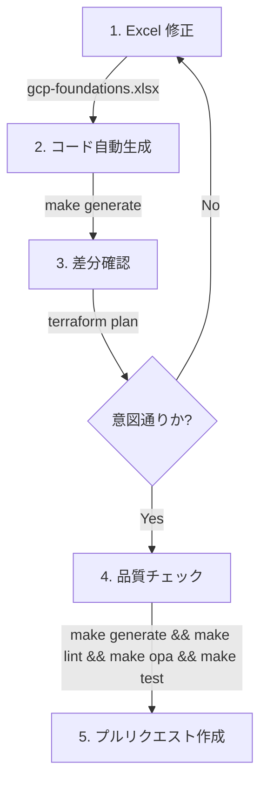

# ローカル開発環境セットアップガイド

本プロジェクト（GCP Foundations）の開発に参加するエンジニア向けの、ローカル環境のセットアップガイドです。

## 1. 必須ツールのインストール

本リポジトリの開発・運用にあたり、以下のツールが必須となります。事前にインストールしてください。

### Terraform (1.6.0 以上)

インフラストラクチャをコードとして管理・デプロイするためのメインツールです。

- [公式インストールガイド](https://developer.hashicorp.com/terraform/install)
- `tfenv` や `asdf`, `mise` などのバージョン管理ツールを使用してプロジェクトごとにバージョンを合わせることを推奨します。

### Google Cloud CLI (gcloud)

GCPリソースへの認証と操作を行うためのCLIツールです。

- [公式インストールガイド](https://cloud.google.com/sdk/docs/install)

### uv (Python パッケージマネージャ)

Terraformの変数ファイル（`tfvars`）やリソース定義を自動生成するPythonスクリプト（`generate_resources.py`）を実行するために使用します。高速で依存関係管理が不要な点が特徴です。

```bash
curl -LsSf [https://astral.sh/uv/install.sh](https://astral.sh/uv/install.sh) | sh
```

### TFLint

Terraformコードの静的解析（Lint）を行い、エラーや非推奨な記述を検知します。

- [公式インストールガイド](https://github.com/terraform-linters/tflint)

```bash
# macOS (Homebrew)
brew install tflint

# Linux
curl -s [https://raw.githubusercontent.com/terraform-linters/tflint/master/install_linux.sh](https://raw.githubusercontent.com/terraform-linters/tflint/master/install_linux.sh) | bash
```

### ShellCheck

運用シェルスクリプトの静的解析を行い、バグや非互換な構文を検知します。

- [公式インストールガイド](https://github.com/koalaman/shellcheck#installing)

```bash
# macOS (Homebrew)
brew install shellcheck

# Ubuntu/Debian
apt-get install shellcheck
```

### Open Policy Agent (OPA)

`.rego` ファイルに記述されたポリシーアズコード（Policy as Code）の構文チェックとテストを実行します。

- [公式インストールガイド](https://www.openpolicyagent.org/docs/latest/#1-download-opa)

```bash
# macOS (Homebrew)
brew install opa
```

______________________________________________________________________

## 2. GCP 認証情報のセットアップ

開発を開始する前に、対象となるGCP組織に対する適切な権限（組織管理者など）を持つアカウントで認証を行う必要があります。

```bash
# gcloud CLIのログイン
gcloud auth login

# アプリケーションのデフォルト認証情報の取得 (Terraform用)
gcloud auth application-default login
```

______________________________________________________________________

## 3. リポジトリのクローンと初期設定

```bash
git clone [https://github.com/ea-Mitsuoka/gcp-foundations.git](https://github.com/ea-Mitsuoka/gcp-foundations.git)
cd gcp-foundations
```

### パスの設定

`terraform/scripts/` 配下にあるスクリプト群にどこからでもアクセスできるよう、シェルの設定ファイル（`.bashrc` または `.zshrc` など）に以下を追記することを推奨します。

```bash
export PATH="$(git rev-parse --show-toplevel 2>/dev/null)/terraform/scripts:$PATH"
```

______________________________________________________________________

## 4. 開発ワークフロー

本リポジトリには、日々の作業を効率化するための `Makefile` が用意されています。
コードの変更を行った後は、コミットする前に以下の `make` コマンドを実行してコードの品質を担保してください。これらはGitHub Actions（CI）でもチェックされます。

### Terraformコードのフォーマットと静的解析 (Lint)

```bash
make lint
```

※ 内部で `terraform fmt`, `tflint`, およびシェルスクリプトの `shellcheck` が実行されます。

### Regoポリシーのチェック

```bash
make opa
```

※ 内部で `opa check policies/*.rego` が実行されます。

### 自動生成スクリプトの実行

SSoT (`gcp-foundations.xlsx`) を更新した後は、手動でスクリプトを実行してリソースを生成します。

```bash
make generate
```

### モジュールとロジックの単体テスト

TerraformモジュールとPythonスクリプトのユニットテストを実行します。

```bash
make test
```

### 検証用テストモードの切り替え (Test Mode)

GCPの仕様（プロジェクト名の30日間ロックや、課金枠の枯渇エラー）に悩まされることなく、スムーズにインフラの検証を回すための「テストモード」が用意されています。

```bash
python3 terraform/scripts/toggle_test_mode.py
```

これを実行して【ON】にすると、以下の機能が有効になります。

1. **名前重複の回避**: プロジェクトIDの接頭辞にランダムな2文字が追加され、手動削除後の 409 Already Exists エラーを防ぎます。
1. **課金枠の節約**: `make deploy` や `make destroy` 実行時、作成に時間と課金枠を大きく消費する管理プロジェクト（`logsink`, `monitoring` 等）が自動的にスキップされます。

検証が終わったら、もう一度コマンドを実行して【OFF】に戻してください。

### 💡 プロの視点: 一括実行ワンライナー

開発中、PRを作成する前の最終確認として、以下のワンライナーで全ての品質ゲートを一括でチェックすることを推奨します。

```bash
make generate && make lint && make opa && make test
```

これがエラーなく完走すれば、CIを確実にパスできる品質に達していると言えます。

______________________________________________________________________

## 5. 基本の開発サイクル (Workflow)

新しいリソースを追加したり、既存の構成を変更したりする際の標準的な流れは以下の通りです。



### ステップ 1: Excel (SSoT) の更新

すべての変更はスプレッドシートから始まります。直接 Terraform ファイルを書き換えるのではなく、Excel に目的の構成を記載してください。

### ステップ 2: コード生成

`make generate` を実行し、Excel の内容を Terraform コードに変換します。

### ステップ 3: 影響範囲の確認

生成されたディレクトリ（例: `terraform/4_projects/xxx`）に移動し、`terraform plan` を実行して、どのようなリソースが作成・変更・削除されるかを慎重に確認します。

### ステップ 4: コード品質の担保

`make lint` をはじめとする各種テストを実行し、構文エラーや命名規則違反がないかを確認します。

### ステップ 5: 共有とレビュー

変更をコミットして PR を作成します。CI による自動チェックをパスし、レビューで承認された後、`make deploy` によって本番環境へ反映されます。
