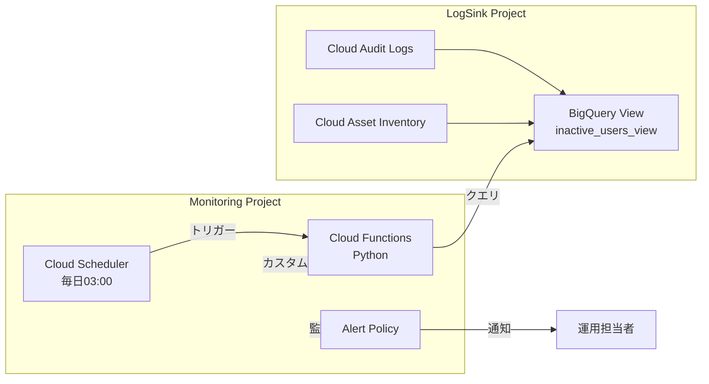

# 非アクティブアカウントの監視方針 (90日間未ログイン検知)

本ドキュメントでは、組織内のセキュリティリスクを低減するために導入されている「90日間活動のないユーザーアカウントを自動検知し、アラート通知する仕組み」について解説します。

---

## 1. 目的 (Objective)

長期間使用されていないユーザーアカウントや、剥奪し忘れた権限は、組織にとって大きな脆弱性となります。本機能は、以下の目的で導入されています。

- **攻撃対象領域 (Attack Surface) の最小化**: 不要な権限を特定し、最小権限の原則を徹底する。
- **ガバナンスの維持**: 退職者や異動者の権限削除漏れを自動的にチェックする。
- **監査対応**: 定期的なアクセス権の棚卸しを自動化し、運用の負荷を軽減する。

---

## 2. 監視の仕組み (Architecture)

本機能は、GCPのネイティブサービスを組み合わせたサーバーレスなアーキテクチャで構成されています。



### 動作フロー
1. **データ集約**: 全プロジェクトの「管理アクティビティ監査ログ」と、組織全体の「IAMポリシー（Cloud Asset Inventory）」が、ログ集約プロジェクトの BigQuery にリアルタイムで転送されます。
2. **分析 (BigQuery View)**: BigQuery 上のビューが、「権限を持っているが、過去90日間に一度も操作ログが記録されていないユーザー」を自動的に抽出します。
3. **定期実行 (Scheduler)**: Cloud Scheduler が毎日午前3時（JST）に Cloud Functions を実行します。
4. **指標化 (Functions)**: 実行された関数は BigQuery ビューの結果（人数）を取得し、Cloud Monitoring のカスタム指標 (`custom.googleapis.com/security/inactive_account_count`) に値を書き込みます。
5. **アラート発報**: 非アクティブなアカウント数が 1 以上の場合、アラートポリシーが作動し、管理者へ通知が送信されます。

---

## 3. アラート発生時の対応フロー

アラートを受信した場合、運用担当者は以下の手順で調査・対応を行います。

### 3.1. 非アクティブアカウントの特定
ログ集約プロジェクト（LogSink）の BigQuery に移動し、以下のビューを検索して、対象のメールアドレスを確認します。

- **データセット**: `security_analytics` (または環境に応じた名称)
- **ビュー名**: `inactive_users_view`

```sql
SELECT * FROM `[PROJECT_ID].security_analytics.inactive_users_view`
```

### 3.2. 調査と判断
特定されたアカウントについて、以下の観点で調査を行います。
- そのユーザーは現在も在籍しているか？（退職していないか）
- 長期休暇中や休職中ではないか？
- その役職や業務において、付与されているIAM権限が現在も必要か？

### 3.3. 対処
調査結果に基づき、以下のいずれかの処置を講じます。
- **権限が不要な場合**: 対象のプロジェクト、または組織レベルで IAM ロールを剥奪します。
- **アカウント自体が不要な場合**: Google Workspace 等の ID 管理システム側でアカウントを無効化・削除します。
- **権限の維持が必要な場合**: 90日間活動がなかった正当な理由（例：緊急時のみ使用する特権 ID など）を記録し、構成管理上の例外として扱います。

---

## 4. 補足事項

- **対象外のアカウント**: 本機能は「ユーザー（人間）」のアカウントを対象としており、サービスアカウントは原則として監視対象から除外されています（※設計により変更可能）。
- **検知の精度**: 「管理アクティビティ（設定変更など）」のログをベースに判定しているため、データの参照（Data Access Logs）のみを行っているユーザーは「非アクティブ」として検知される場合があります。
