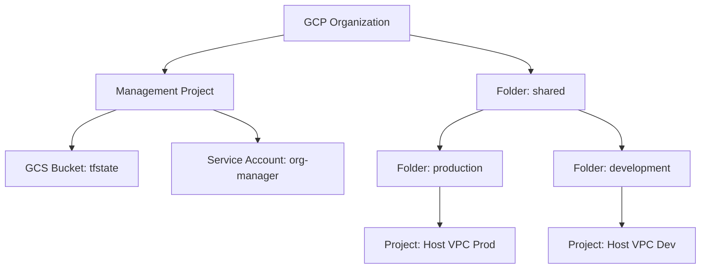

# 初期環境セットアップガイド (ミーティング・セッション用)

本ドキュメントは、新しい GCP 組織に対して「GCP Foundations」を構築する際の、顧客（オーナー）と構築者による共同作業のガイドです。

画面共有をしながら、本ドキュメントの手順に沿って意思決定と操作を進めてください。

______________________________________________________________________

## 1. 構築完了後のイメージ (Target Architecture)

本手順が完了すると、GCP 組織内に以下の構造が自動生成されます。



______________________________________________________________________

## 2. 事前準備 (Preparation)

セッションを開始する前に、以下の準備が完了していることを確認してください。**これらが未完了の場合、構築を勧めることができません。**

### 2.1 組織の準備 (GCP Organization)
- [ ] **ドメイン認証**: ドメイン所有権の証明が完了し、GCP コンソール上で「組織」リソースが選択可能な状態であること。
- [ ] **Cloud Identity / Google Workspace**: ユーザーやグループを管理するための ID 基盤がセットアップ済みであること。

### 2.2 管理権限とグループ
- [ ] **特権管理者**: 顧客の作業者が Cloud Identity / Google Workspace の特権管理者（またはグループ作成権限を持つ管理者）であること。
- [ ] **Google Groups**: 以下の管理用グループが作成済みであること。
  - `gcp-organization-admins@<domain>`
  - `gcp-security-admins@<domain>`
  - `gcp-network-admins@<domain>`
  - `gcp-billing-admins@<domain>`
- [ ] **権限付与**: 構築者（または作業用 SA）に対して、一時的に組織レベルの「組織管理者」および「請求先アカウント管理者」権限が付与されていること。

### 2.3 環境・認証
- [ ] **認証**: 構築者の環境で `gcloud auth login` および `gcloud auth application-default login` が完了していること。

______________________________________________________________________

## 3. セットアップ・セッションの流れ

### ステップ 1: 初期リソースの自動作成

構築者が `make setup` を実行し、ターミナル上で設定値を入力していきます。

```bash
make setup
```

#### 💡 顧客との意思決定ポイント

スクリプト実行中、以下の項目について質問されます。顧客の要件に合わせて回答を選択してください。

| 項目 | 説明 | 選択の目安 |
| :--- | :--- | :--- |
| **Shared VPC** | ネットワークを中央管理し、各プロジェクトに共有するか。 | **推奨: true**。管理が効率化され、セキュリティが向上します。 |
| **VPC-SC** | セキュリティ境界で API アクセスを制限するか。 | 非常に厳しい機密情報を扱う場合は true。初期は false でも可。 |
| **Org Policies** | 組織全体にガードレール（外部IP禁止等）を課すか。 | **移行作業がある場合は false** を推奨。後から有効化可能です。 |

______________________________________________________________________

### ステップ 2: 課金アカウントのリンク (顧客作業)

スクリプトの途中で、GCP の仕様により**顧客側での手動操作**が必要になります。

1. 画面に表示される `gcloud billing projects link ...` コマンドを（または GCP コンソールで）実行してください。
1. 完了後、構築者が [Enter] を押してスクリプトを続行します。

______________________________________________________________________

### ステップ 3: 定義ファイル (SSOT) の準備と反映

構成の「設計図」となる Excel ファイルに要件を記入し、それに基づいて Terraform コードを出力します。

> **💡 ヒント**: 顧客と画面共有をしながら設計を行う場合は、以下のワークショップ・ガイドを参照するとスムーズです。
>
> - **[スプレッドシート・ワークショップ・ガイド](../operations/spreadsheet_session_guide.md)**

#### 📝 作業手順

1. **設計図の準備**: プロジェクトルートにある `gcp_foundations.xlsx` を開き、顧客と一緒に必要なフォルダ構造、プロジェクト名、適用するポリシーを決定・記入（保存）します。
   - ※ ファイルが存在しない場合は `make generate` を実行すると、サンプル付きのテンプレートが作成されます。
1. **コードの出力**: 記入完了後、以下のコマンドを実行して、Excel の内容を Terraform 定義ファイル（`auto_*.tf`, `tfvars`）として出力します。
   ```bash
   make generate
   ```

#### 💡 `make generate` の役割

このコマンドは、**Excel（設計図）の内容を読み取り、Terraform が実行可能な形式に変換して出力**する役割を担います。Excel を更新した際は、必ずこのコマンドを再実行してコードを最新化してください。

______________________________________________________________________

### ステップ 4: インフラの展開 (Deployment)

最終的なデプロイを実行します。

```bash
# Layer 0 の適用
cd terraform/0_bootstrap && terraform init && terraform apply

# 全レイヤーの一括適用
cd ../../ && make deploy
```

______________________________________________________________________

## 4. 完了後の引き継ぎ

構築完了後、プロジェクトの追加・削除などの日常的な運用については **[プロジェクトのライフサイクル管理](../operations/project_lifecycle.md)** を参照してください。
